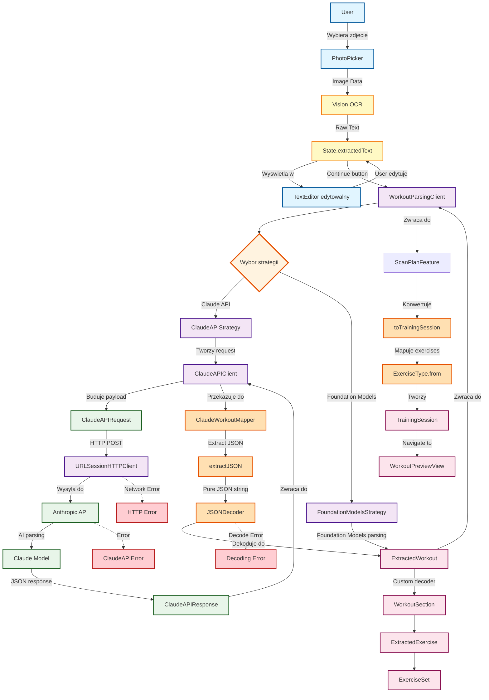

# Claude API Workout Parsing - Flow Diagram

```mermaid
graph TD
    User[User] -->|Wybiera zdjecie| PhotoPicker[PhotoPicker]
    PhotoPicker -->|Image Data| OCR[Vision OCR]

    OCR -->|Raw Text| StateText[State.extractedText]
    StateText -->|Wyswietla w| TextEditor[TextEditor edytowalny]

    TextEditor -->|User edytuje| StateText
    StateText -->|Continue button| ParsingClient[WorkoutParsingClient]

    ParsingClient --> StrategyDecision{Wybor strategii}
    StrategyDecision -->|Claude API| ClaudeStrategy[ClaudeAPIStrategy]
    StrategyDecision -->|Foundation Models| FMStrategy[FoundationModelsStrategy]

    ClaudeStrategy -->|Tworzy request| APIClient[ClaudeAPIClient]
    APIClient -->|Buduje payload| Request[ClaudeAPIRequest]

    Request -->|HTTP POST| HTTPClient[URLSessionHTTPClient]
    HTTPClient -->|Wysyla do| AnthropicAPI[Anthropic API]

    AnthropicAPI -->|AI parsing| Claude[Claude Model]
    Claude -->|JSON response| APIResponse[ClaudeAPIResponse]

    APIResponse -->|Zwraca do| APIClient
    APIClient -->|Przekazuje do| Mapper[ClaudeWorkoutMapper]

    Mapper -->|Extract JSON| JSONExtractor[extractJSON]
    JSONExtractor -->|Pure JSON string| Decoder[JSONDecoder]

    Decoder -->|Dekoduje do| ExtractedWorkout[ExtractedWorkout]

    FMStrategy -->|Foundation Models parsing| ExtractedWorkout

    ExtractedWorkout -->|Custom decoder| WorkoutSection[WorkoutSection]
    WorkoutSection --> ExtractedExercise[ExtractedExercise]
    ExtractedExercise --> ExerciseSet[ExerciseSet]

    ExtractedWorkout -->|Zwraca do| ParsingClient
    ParsingClient -->|Zwraca do| Feature[ScanPlanFeature]

    Feature -->|Konwertuje| DomainMapper[toTrainingSession]
    DomainMapper -->|Mapuje exercises| ExerciseMapper[ExerciseType.from]

    ExerciseMapper -->|Tworzy| TrainingSession[TrainingSession]
    TrainingSession -->|Navigate to| Preview[WorkoutPreviewView]

    AnthropicAPI -.->|Error| APIError[ClaudeAPIError]
    HTTPClient -.->|Network Error| HTTPError[HTTP Error]
    Decoder -.->|Decode Error| DecodeError[Decoding Error]

    classDef userLayer fill:#e1f5ff,stroke:#01579b,stroke-width:2px
    classDef stateLayer fill:#fff9c4,stroke:#f57f17,stroke-width:2px
    classDef clientLayer fill:#f3e5f5,stroke:#4a148c,stroke-width:2px
    classDef apiLayer fill:#e8f5e9,stroke:#1b5e20,stroke-width:2px
    classDef mapperLayer fill:#ffe0b2,stroke:#e65100,stroke-width:2px
    classDef modelLayer fill:#fce4ec,stroke:#880e4f,stroke-width:2px
    classDef errorLayer fill:#ffcdd2,stroke:#b71c1c,stroke-width:2px
    classDef decisionLayer fill:#fff3e0,stroke:#e65100,stroke-width:3px

    class User,PhotoPicker,TextEditor userLayer
    class StateText,OCR stateLayer
    class ParsingClient,ClaudeStrategy,FMStrategy,APIClient,HTTPClient clientLayer
    class AnthropicAPI,Claude,Request,APIResponse apiLayer
    class Mapper,JSONExtractor,Decoder,DomainMapper,ExerciseMapper mapperLayer
    class ExtractedWorkout,WorkoutSection,ExtractedExercise,ExerciseSet,TrainingSession,Preview modelLayer
    class APIError,HTTPError,DecodeError errorLayer
    class StrategyDecision decisionLayer
```

