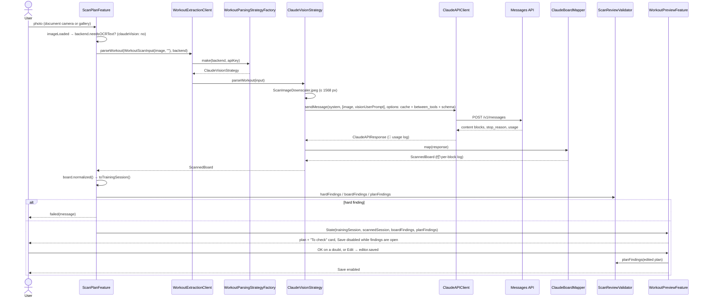

# Plan scan — sequence (schema v2, photo path)

```mermaid
sequenceDiagram
    actor User
    participant Scan as ScanPlanFeature
    participant Client as WorkoutExtractionClient
    participant Factory as WorkoutParsingStrategyFactory
    participant Vision as ClaudeVisionStrategy
    participant API as ClaudeAPIClient
    participant Anthropic as Messages API
    participant Mapper as ClaudeBoardMapper
    participant Validator as ScanReviewValidator
    participant Preview as WorkoutPreviewFeature

    User->>Scan: photo (document camera or gallery)
    Scan->>Scan: imageLoaded → backend.needsOCRText? (claudeVision: no)
    Scan->>Client: parseWorkout(WorkoutScanInput(image, ""), backend)
    Client->>Factory: make(backend, apiKey)
    Factory-->>Client: ClaudeVisionStrategy
    Client->>Vision: parseWorkout(input)
    Vision->>Vision: ScanImageDownscaler.jpeg (≤ 1568 px)
    Vision->>API: sendMessage(system, [image, visionUserPrompt], options: cache + between_tools + schema)
    API->>Anthropic: POST /v1/messages
    Anthropic-->>API: content blocks, stop_reason, usage
    API-->>Vision: ClaudeAPIResponse (🧾 usage log)
    Vision->>Mapper: map(response)
    Mapper-->>Vision: ScannedBoard (📦 per-block log)
    Vision-->>Scan: ScannedBoard
    Scan->>Scan: board.normalized() → toTrainingSession()
    Scan->>Validator: hardFindings / boardFindings / planFindings
    alt hard finding
        Scan-->>User: failed(message)
    else
        Scan->>Preview: State(trainingSession, scannedSession, boardFindings, planFindings)
        Preview-->>User: plan + "To check" card, Save disabled while findings are open
        User->>Preview: OK on a doubt, or Edit → editor.saved
        Preview->>Validator: planFindings(edited plan)
        Preview-->>User: Save enabled
    end
```
