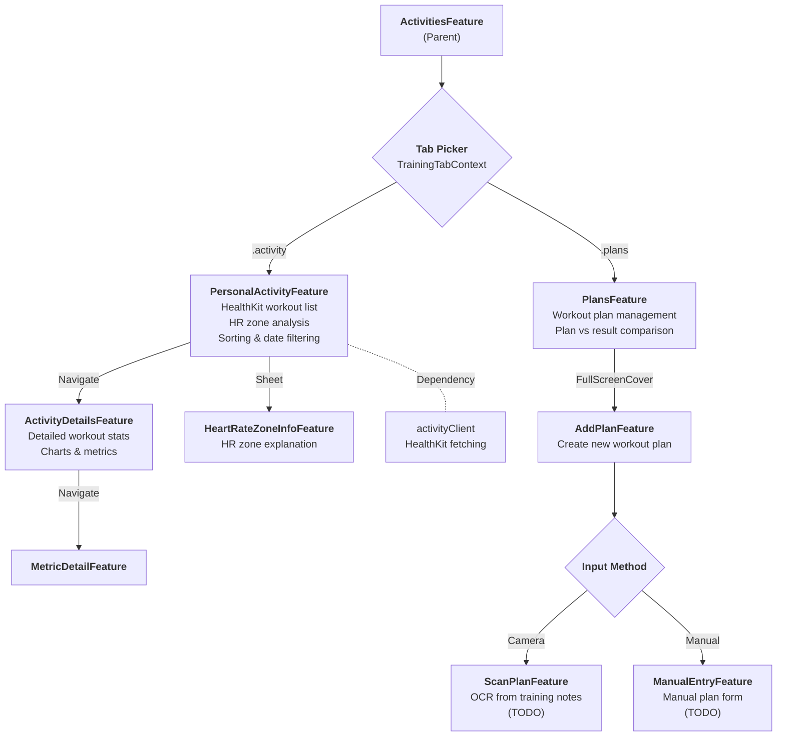

# ActivitiesTab Architecture

## Feature Hierarchy (Mermaid)



## Feature Hierarchy (ASCII Art)

```
┌─────────────────────────────────────────────────────────────────┐
│                    ACTIVITIES FEATURE                           │
│                         (Parent)                                │
└──────────────────────────┬──────────────────────────────────────┘
                           │
                    ┌──────┴──────┐
                    │ TAB PICKER  │
                    │   ◇ ◇ ◇     │
                    └──────┬──────┘
                           │
         ┌─────────────────┴─────────────────┐
         │ .activity                  .plans │
         ▼                                   ▼
┌─────────────────────┐         ┌─────────────────────┐
│ PersonalActivity    │         │    PlansFeature     │
│ Feature             │         │                     │
│ ─────────────────── │         │ ─────────────────── │
│ • HealthKit list    │         │ • Plan management   │
│ • HR zone analysis  │         │ • Plan vs result    │
│ • Sort & filter     │         │                     │
└─────────┬───────────┘         └─────────┬───────────┘
          │                               │
    ┌─────┴─────┐                   FullScreenCover
    │           │                         │
Navigate     Sheet                        ▼
    │           │               ┌─────────────────────┐
    ▼           ▼               │   AddPlanFeature    │
┌───────────┐ ┌─────────┐       │ ─────────────────── │
│ Activity  │ │ ZoneInfo│       │ • Create new plan   │
│ Details   │ │ Feature │       └─────────┬───────────┘
│ Feature   │ └─────────┘                 │
└─────┬─────┘                    ┌────────┴────────┐
      │                          │  INPUT METHOD   │
   Navigate                      │      ◇ ◇ ◇      │
      │                          └────────┬────────┘
      ▼                     ┌─────────────┴─────────────┐
┌───────────┐               │ Camera              Manual│
│ Metric    │               ▼                           ▼
│ Detail    │        ┌────────────┐            ┌────────────┐
│ Feature   │        │ ScanPlan   │            │ ManualEntry│
└───────────┘        │ [TODO]     │            │ [TODO]     │
                     └────────────┘            └────────────┘
```
