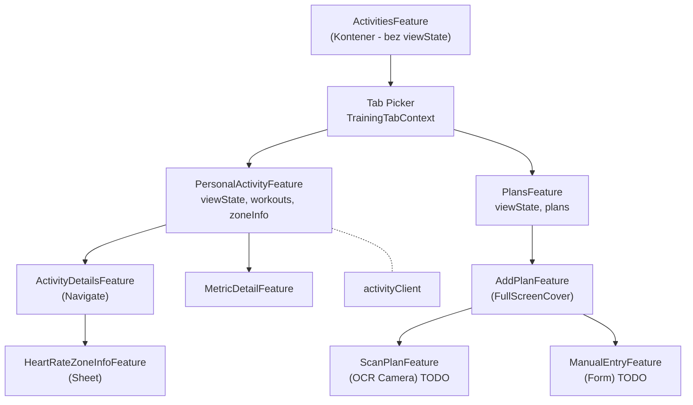

# ActivitiesTab Architecture

## Feature Hierarchy (Mermaid)



## Feature Hierarchy (ASCII Art)

```
┌─────────────────────────────────────────────────────────────────┐
│                    ActivitiesFeature                            │
│                    (Kontener - bez viewState)                   │
│                    State: context, color, 2x child              │
└──────────────────────────┬──────────────────────────────────────┘
                           │
              ┌────────────┴────────────┐
              │     Tab Picker          │
              │  .activity / .plans     │
              └────────────┬────────────┘
                           │
          ┌────────────────┴────────────────┐
          │                                 │
          ▼                                 ▼
┌─────────────────────────┐     ┌─────────────────────────┐
│ PersonalActivityFeature │     │     PlansFeature        │
│ ─────────────────────── │     │ ─────────────────────── │
│ viewState               │     │ viewState               │
│ workouts: [HKWorkout]   │     │ plans: [WorkoutPlan]    │
│ zoneInfo: [UUID: Zone]  │     │                         │
│ maxHeartRate            │     │                         │
│ days, sortDescriptors   │     │                         │
└───────────┬─────────────┘     └───────────┬─────────────┘
            │                               │
   ┌────────┴────────┐                      │
   │                 │                      │
   ▼                 ▼                      ▼
┌──────────┐  ┌──────────────┐    ┌─────────────────────┐
│ Activity │  │ MetricDetail │    │   AddPlanFeature    │
│ Details  │  │   Feature    │    │ (FullScreenCover)   │
│ Feature  │  │              │    │                     │
│(Navigate)│  └──────────────┘    └──────────┬──────────┘
└────┬─────┘                                 │
     │                          ┌────────────┴────────────┐
     ▼                          │                         │
┌────────────────┐              ▼                         ▼
│ HeartRateZone  │    ┌─────────────────┐     ┌─────────────────┐
│ InfoFeature    │    │  ScanPlan       │     │  ManualEntry    │
│ (Sheet)        │    │  Feature        │     │  Feature        │
└────────────────┘    │  (OCR) TODO     │     │  (Form) TODO    │
                      └─────────────────┘     └─────────────────┘
```

